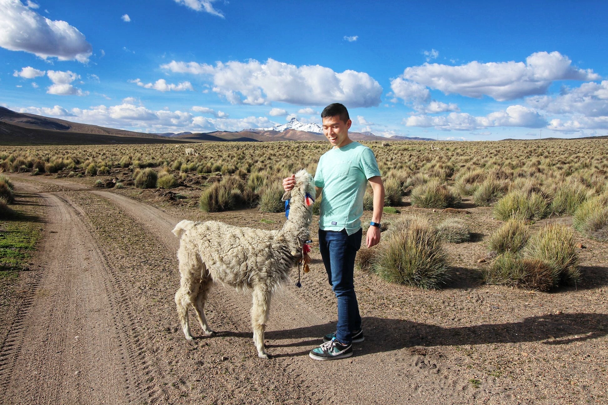

Hi! My name is Raymond. I'm a mission-driven software engineer interested in using technology to solve problems and improve the lives of others. I take a human-centered and pragmatic approach to software development and I believe in iteration and feedback over perfection. <strong>I most enjoy working on the front end</strong>, though I have worked across the stack and can put on other hats if necessary. On top of coding, I have experience leading projects, organizing timelines, and collaborating with cross-functional stakeholders.

Technologies I have experience with (or, a bunch of buzzwords):
- JavaScript, HTML, CSS
- React, Redux, TypeScript, Flow
- Jest, React Testing Library, Enzyme
- Ruby on Rails, RSpec
- Styled Components, Sass
- Figma, Sketch

Currently I'm a front end engineer at <a href="https://frontapp.com/" target="_blank">Front</a> building the best platform to manage customer communications. Previously I was a full stack engineer on the <a href="https://gusto.com/product/benefits" target="_blank">Benefits team at Gusto</a>, working on delightful features to make healthcare more accessible to small businesses and their employees.

Before I was a real adult, I studied Computer Science and Human-Computer Interaction at Stanford. Originally from New York, I first came to California for school and decided that sun is better than snow so I stuck around after graduation. I currently reside in San Francisco and in my free time, I enjoy yoga, fitness, hiking, <a href="https://www.goodreads.com/user/show/89704424-raymond-luong" target="_blank">reading</a>, edm, indie rock, and travel. I'm always down to chat about JavaScript ( 🤓), what book you're currently reading, dairy-free alternatives, and the best group fitness classes in SF (i.e. Barry's Bootcamp).

Thanks for reading! Here's a picture of me petting an incredibly soft llama:

