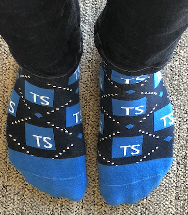

Last month, I had the privilege of flying to Seattle and attending <a href="https://tsconf.io" target="_blank">TSConf</a>, a one-day single-track conference all about TypeScript! I want to share some of my key takeaways and what I’m excited about going forward.

## Start with the Problem

My first takeaway is from Lauren Tan, an engineer manager at Netflix. The main theme of her talk was the importance of starting with a problem and then finding the right technology to solve that problem. Sometimes, as engineers, we’ll learn about a shiny new technology and try to find a way to use it on our team, yet run into issues convincing other folks to hop aboard because it doesn’t have a real business impact or it solves a manufactured problem.

For example, a problem with vanilla JavaScript can be the difficulty of reading the shape of data, especially for more complex objects, and the lost developer velocity from trying to understand that data. TypeScript can help solve that problem because types improve the readability of the code and add type safety, which in turn help catch bugs earlier and increase developer productivity. 

## Developer Experience

The TypeScript team is engaged with the community and invested in improving the developer experience. During the keynote, Anders Hejlsberg, one of the core developers on the TypeScript team at Microsoft, highlighted an example where a type error in a deeply nested object would output a nested pyramid of errors and obscure the source of the error. The TypeScript team responded to feedback from the community and flattened the pyramid of errors to be more readable.

Another example is the improvements the TypeScript team made to the <a href="http://www.typescriptlang.org/play/" target="_blank">TypeScript Playground</a>, which makes it even easier to get started with trying TypeScript. Recent updates have added a formatter that supports JSX syntax, the ability o save code and settings to the URL to return later, and support for different versions of TypeScript, which in turn enables the ability to try out experimental features that are part of beta versions. Speaking of…

## Experimental Features

TypeScript has the ability try out experimental features that are being proposed for JavaScript. Two key examples (and two features that I’m personally very excited about) are <a href="https://github.com/tc39/proposal-optional-chaining" target="_blank">optional chaining</a> and <a href="https://github.com/tc39/proposal-nullish-coalescing" target="_blank">nullish coalescing</a>. At time of writing, they’re both TC39 stage 3 proposals, but they are incorporated in the beta version of TypeScript 3.7 and it’s very likely that they’ll be released on TypeScript first.

## Community Momentum

TypeScript has been gaining significant traction over the past few years. Based on the <a href="https://2018.stateofjs.com/javascript-flavors/typescript/" target="_blank">State of JavaScript survey from 2018</a>, the percentage of responders that have used TypeScript and would use it again has been steadily rising. Similarly, in the <a href="https://octoverse.github.com/projects#languages" target="_blank">Github Octoverse analysis also from 2018</a>, TypeScript made its way into the top 10 for the first time in 2017 and jumped up to seventh place in 2018. Additionally, in the same Github analysis, <a href="https://github.com/DefinitelyTyped/DefinitelyTyped" target="_blank">DefinitelyTyped</a>, the open-source repository of type definitions, is one of the top open source projects and had 6,000 unique contributors in 2018. I also recall one of the speakers at TSConf mention that DefinitelyTyped has more PRs created that can be feasibly reviewed by the maintainers (unfortunately I didn’t manage to take a note of this at the time, so don’t quote me on this 😉). There’s a lot of energy and momentum around TypeScript right now and I’m excited for what’s in store.

## Going forward

It was easy for me to get started with exploring TypeScript — I just had to open the playground and it was all there for me to try, including the new features that I’ve wanted in vanilla JavaScript for a while. I’m about to start a new project at work and I’m excited about building all of the React components with TypeScript because it’ll provide type safety, help catch bugs, and improve code readability and developer productivity. 

Lastly, I’m looking forward to wearing these awesome TypeScript socks that were included in the goodie bag. My current company Gusto has a shoeless office — a perfect chance to show them off!

